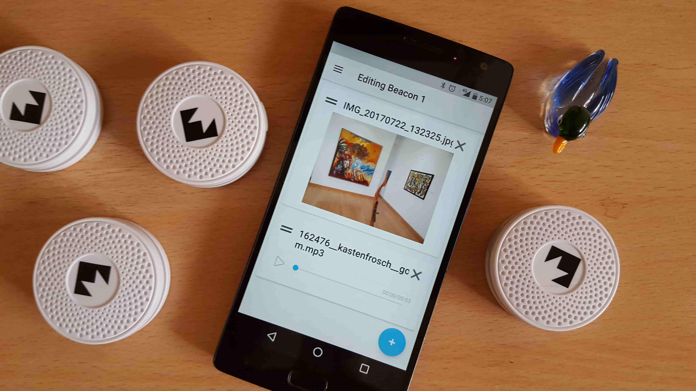

# Physical Web Content Manager
Provide a seamless layer of digital information to the visitors of your museum, gallery or other large space.

The Physical Web Content Manager app allows you to enroll your beacons, set up the contents that will be served to users in their proximity, and configure exhibits to rotate the contents of the beacons conveniently.

This app is a companion to the Physical Web webapp package, allowing you to configure the content that is served to your visitors. All content is stored in open formats on Google Drive, so that the contents of your beacons are easily accessed, without lock-in.

### Credits
Developed by Mohammad Kayali for Google Summer of Code 2017, with generous support from his mentors Andreu Ibanez, Jorge Carballo and Fran Cabrera.

#### Graphics
* Wireless by Edward Boatman from the Noun Project
* sculpture by Ivan Novelo from the Noun Project
